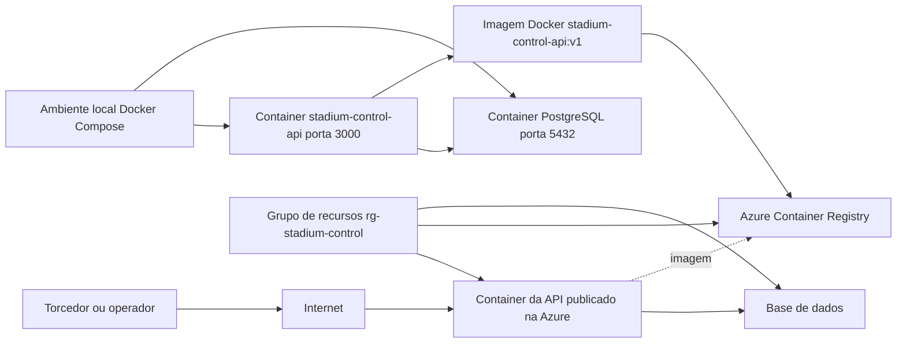

# Stadium Control API

Sistema de controle de ingressos para partidas da Copa do Mundo. A aplicacao permite cadastrar, consultar, atualizar e excluir ingressos, ajudando a organizacao a identificar ingressos validos, utilizados, cancelados, suspeitos e duplicados.

## Problema escolhido

Em jogos da Copa do Mundo, falhas no controle de ingressos podem gerar filas, tentativas de acesso indevido, duplicidade de ingressos e dificuldade para validar a entrada dos torcedores. O publico afetado inclui torcedores, equipes de seguranca, operadores de portao e a organizacao do evento.

## Objetivo

Oferecer uma API simples, conteinerizada e integrada a PostgreSQL para controlar ingressos por codigo, torcedor, documento, partida, estadio, setor, assento, valor, status e data da compra.

## Tecnologias

- Node.js
- Express
- PostgreSQL
- Docker
- Docker Compose
- Azure CLI
- Azure Container Registry

## Estrutura

```text
.
|-- db/init.sql
|-- scripts/azure-cli.ps1
|-- scripts/azure-cli.sh
|-- src/db.js
|-- src/routes.js
|-- src/server.js
|-- Dockerfile
|-- docker-compose.yml
|-- package.json
`-- README.md
```

## Banco de dados

Tabela principal: `ingressos`

Campos principais:

- `id`: chave primaria
- `codigo`: codigo unico do ingresso
- `nome_torcedor`
- `documento`
- `partida`
- `estadio`
- `setor`
- `assento`
- `valor`
- `status`: `valido`, `utilizado`, `cancelado`, `suspeito` ou `duplicado`
- `data_compra`
- `criado_em`

O arquivo `db/init.sql` cria a tabela e insere 5 registros para demonstracao.

## Como executar localmente

```bash
docker build -t stadium-control-api .
docker compose up -d
docker compose ps
docker images
docker logs stadium-control-api
```

A API fica disponivel em:

```text
http://localhost:3001
```

Verificar saude da aplicacao e conexao com banco:

```bash
curl http://localhost:3001/api/health
```

Finalizar o ambiente:

```bash
docker compose down
```

Para remover tambem o volume do banco:

```bash
docker compose down -v
```

## Variaveis de ambiente

```text
PORT=3000
DB_HOST=stadium-control-db
DB_USER=stadium_user
DB_PASSWORD=stadium_password
DB_NAME=stadium_control
DB_PORT=5432
```

## Testar CRUD

### CREATE

```bash
curl -X POST http://localhost:3001/api/ingressos \
  -H "Content-Type: application/json" \
  -d '{
    "codigo": "CUP-2026-0006",
    "nome_torcedor": "Rafael Martins",
    "documento": "66677788899",
    "partida": "Brasil x Italia",
    "estadio": "MetLife Stadium",
    "setor": "F",
    "assento": "F10",
    "valor": 500,
    "status": "valido",
    "data_compra": "2026-06-06"
  }'
```

### READ

```bash
curl http://localhost:3001/api/ingressos
curl http://localhost:3001/api/ingressos/1
```

### UPDATE

```bash
curl -X PUT http://localhost:3001/api/ingressos/1 \
  -H "Content-Type: application/json" \
  -d '{"status": "utilizado"}'
```

### DELETE

```bash
curl -X DELETE http://localhost:3001/api/ingressos/1
```

## Dockerfile

O `Dockerfile` usa `node:20`, define `/app` como diretorio de trabalho, copia os arquivos do projeto, instala dependencias, expoe a porta `3000` e inicia a API com `node src/server.js`.

## Docker Compose

O `docker-compose.yml` possui dois servicos:

- `stadium-control-api`: container da aplicacao Node.js, porta `3000`.
- `stadium-control-db`: container PostgreSQL, porta interna `5432` e porta local `5433`, volume persistente e script SQL inicial.

Os servicos se comunicam pela rede `stadium-control-network`.

## Publicar imagem no Azure Container Registry

Edite o nome do ACR nos scripts para um nome unico. Depois execute um dos arquivos:

```bash
bash scripts/azure-cli.sh
```

ou no PowerShell:

```powershell
.\scripts\azure-cli.ps1
```

Comandos principais exigidos:

```bash
az login
az group create --name rg-stadium-control --location eastus
az acr create --resource-group rg-stadium-control --name acrstadiumcontrol123 --sku Basic
az acr login --name acrstadiumcontrol123
docker build -t stadium-control-api:v1 .
docker tag stadium-control-api:v1 acrstadiumcontrol123.azurecr.io/stadium-control-api:v1
docker push acrstadiumcontrol123.azurecr.io/stadium-control-api:v1
az acr repository list --name acrstadiumcontrol123 --output table
az acr repository show-tags --name acrstadiumcontrol123 --repository stadium-control-api --output table
az group delete --name rg-stadium-control --yes
```

## Arquitetura cloud



Use esse diagrama como base para criar a imagem da arquitetura no Draw.io, PowerPoint, Canva ou outra ferramenta visual.

## Conteudo para o PDF final

O PDF final deve conter:

- Capa com nome completo, RM, turma, disciplina, professor e nome do projeto.
- Problema escolhido, contexto, publico afetado e objetivo.
- Tecnologias utilizadas.
- Modelo da tabela `ingressos`.
- Explicacao das rotas de CRUD.
- Print do codigo, Dockerfile, Docker Compose e `db/init.sql`.
- Prints dos comandos Docker executados.
- Prints de CREATE, READ, UPDATE e DELETE funcionando.
- Prints da imagem no ACR e dos comandos Azure CLI.
- Diagrama de arquitetura cloud.
- Print da exclusao dos recursos no Azure.
